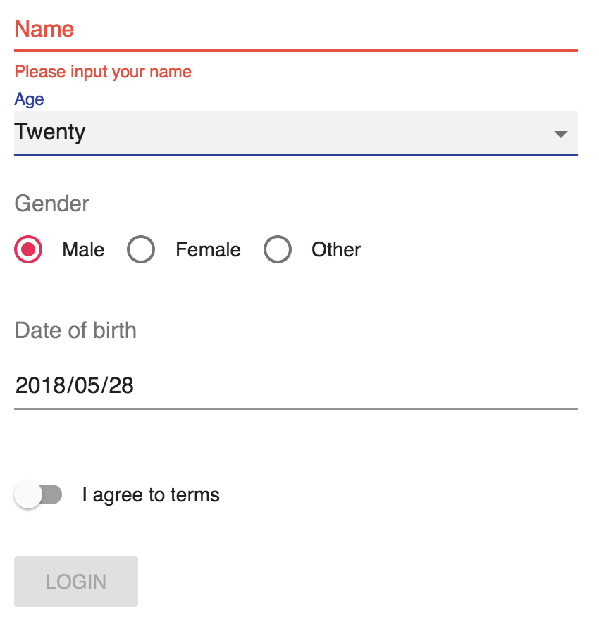

# Easy Form

> Easy Form is a React HOC that allow you to build forms easily and flexibly.

## Example

[Demo](https://loadingwyn.github.io/easy-form)



<!--  -->

## Features

- easy: manage form state conveniently
- flexible: create awesome form easily with Material-UI, Ant-Design, Redux or any library you like.
- powerful: support sync/async validation both.
- tiny: only 19.7kb ungzipped.

## Get Started

1.  Run `yarn add easy-form react react-dom prop-types`

2.  Render it!

```js
import React from 'react';
import { ValidationField, createForm } from '../src';

const schema = {
  name: {
    validator: name =>
      new Promise((res, rej) => {
        setTimeout(() => {
          if (name) {
            res(name);
          } else {
            rej(name);
          }
        }, 200);
      }),
    message: 'Please input your username',
  },
  password: {
    validator: password => password,
    message: 'Please input your password',
  },
};

class LoginForm extends React.PureComponent {
  handleSubmit = e => {
    e.preventDefault();
    const { submit } = this.props;
    submit(data => console.log(data), error => console.log(error))();
  };
  render() {
    const { isValid } = this.props;
    return (
      <form onSubmit={this.handleSubmit}>
        <ValidationField name="name" label="Username">
          <input placeholder="Username" />
        </ValidationField>
        <ValidationField name="password" label="Password">
          <input placeholder="Password" />
        </ValidationField>
        <button
          style={{
            display: 'inline-block',
            marginLeft: 180,
          }}
          disabled={!isValid}
          type="submit">
          Login
        </button>
      </form>
    );
  }
}

export default createForm({}, schema)(LoginForm);
```

## Apis

### createForm(defaultValues, schema, options)

#### usage:

```js
const schema = {
  birth: {
    validator: date => (date ? true : false),
    message: 'Please input your date of birth',
  },
  description: [
    {
      validator: description => (description ? true : false),
      message: 'Please input your description',
    },
    {
      validator(date) {
        return new Promise((res, rej) => {
          setTimeout(() => {
            date === 'loading' ? res(date) : rej(date);
          }, 0);
        });
      },
      message: name => `"${name}" is not my name!`,
    },
  ],
};
const DecoratedForm = createForm(
  {
    birth: '2018-05-28',
  },
  schema,
  { fieldRender },
)(CustomizedForm);
```

#### defaultValues: `Object`

Default values of the form.

#### schema: `Object<[field: string]: Validator>`

`validator: (target: any, values: Object, preValues: Object, customOptions: Object) => bool | Promise`

The validation rules of the form. You pass an array to customize more than one validators. And the validators will be executed sequentially.
If validation passes, it should return `true` or a resolved promise. Else, it should return `false` or a rejected promise. The message should be a string or a function that receives value of input and result of validation and returns a string.

#### options: `Object`

| Property          | Type | Default value                       | Description                                                                                                                                                                                                                                       |
| :---------------- | :--- | :---------------------------------- | :------------------------------------------------------------------------------------------------------------------------------------------------------------------------------------------------------------------------------------------------ |
| fieldRender       | Func | [fieldRender](./src/fieldRender.js) | The field render prop. <br /> Arguments: <br /> fieldProps: `Object` - Props collection of form field <br > Returns `Object` — The React node to render.                                                                                          |
| onFormChange      | Func |                                     | Callback fired when the value of `ValidationField` gets changed.<br /> Arguments: <br /> props: `Object` — Props of The form component <br /> changedValue: `Object` — Value of the changed field <br /> defaultHandler: `Func` - Default handler |
| onFormReset       | Func |                                     | Callback fired when the form is reset.<br /> Arguments: <br /> props: `Object` — Props of The form component <br /> newValues: `Object` — The reset value <br /> defaultHandler: `Func` - Default handler                                         |
| getValueFromEvent | Func |                                     | Customized method to get value from event arguments.<br /> Arguments: <br /> same as event callback                                                                                                                                               |

If the form has been decorated by `createForm` then it owns APIs as follows:

| Property     | Type | Description                                                                                                                                                                                            |
| :----------- | :--- | :----------------------------------------------------------------------------------------------------------------------------------------------------------------------------------------------------- |
| isValid      | bool | Whether the form is valid (has no validation error).                                                                                                                                                   |
| isPristine   | bool | Whether the current values of form are different from the initial values.                                                                                                                              |
| isValidating | bool | Whether the form is validating.                                                                                                                                                                        |
| initialize   | Func | Resets the form to specified values.                                                                                                                                                                   |
| submit       | Func | Submits the form. Returns a promise that will be resolved when the form is submitted successfully, or rejected if the submission fails.<br /> Arguments: <br /> onSuccess: `Func`<br /> onFail: `Func` |
| updateValues | Func | Updates values of the form. <br /> Arguments: <br /> newValues: `Object`                                                                                                                               |
| updateSchema | Func | Updates schema of the form. <br /> Arguments: <br /> newSchema: `Object`                                                                                                                               |
| validateAll  | Func | Validates the form.                                                                                                                                                                                    |
| validateItem | Func | Validates the specified field. <br /> Arguments: <br /> name: `string` - Name of the field to validate <br />                                                                                          |

### ValidationField

| Property        | Type   | Default value | Description                                                                                                                                                                               |
| :-------------- | :----- | :------------ | :---------------------------------------------------------------------------------------------------------------------------------------------------------------------------------------- |
| formatter       | Func   |               | The Handler that format the value. <br /> Arguments: <br /> value: `string \| boolean \| number` — The value of input.<br /> Returns `Object` — The formatted value.                      |
| name            | string | Required      | The unique identifier of field, corresponding to a value in the form values.                                                                                                              |
| onValidate      | Func   |               | Callback fired after validation.<br /> Arguments: <br /> result: `Object` — The result of validation. You can pull out the return of the validator by accessing `result.promiseValue`.    |
| options         | Object |               | Additional options that can be passed to the validator function.                                                                                                                          |
| render          | Func   | Required      | A render prop. Use the property to get what to render.<br /> Arguments: <br />props: `Object` — Please refer to `options.fieldRender`. <br />Returns `Object` — The React node to render. |
| trigger         | string | onChange      | When to collect the value of children node.                                                                                                                                               |
| validateTrigger | string | onChange      | When to validate the value of children node.                                                                                                                                              |
| valuePropName   | string | value         | Prop that should be validated. For example, the `valuePropName` of checkbox is `checked`.                                                                                                 |
